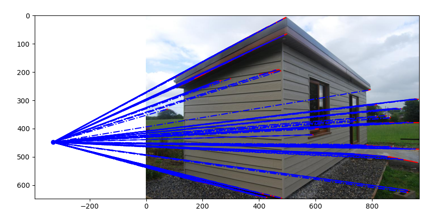

# PyVPD: Vanishing Point Detector

[](https://github.com/SajjadAemmi/PyVPD/actions/workflows/python-publish.yml)

This is a Python + Scikit-Image implementation of the Vanishing point detection in images

## Installation
```
pip install pyvpd
```

## Usage

```python
import cv2
from pyvpd import VPDetector

image = cv2.imread("io/input/1.jpg")
image = cv2.cvtColor(image, cv2.COLOR_BGR2RGB)

vp_detector = VPDetector()
vps_3d, vps_2d = vp_detector.detect(image)
print("vps_3d:", vps_3d)
print("vps_2d:", vps_2d)
```

## Results

Input image:


First vanishing point:



Second vanishing point:


## Acknowledgments
We made necessary changes on top of [Automated Rectification of Image](https://github.com/chsasank/Image-Rectification) to fit our design. Many thanks to Sasank Chilamkurthy for releasing the code.

Implements the modified version of the following paper:  

[Chaudhury, Krishnendu, Stephen DiVerdi, and Sergey Ioffe. "Auto-rectification
of user photos." 2014 IEEE International Conference on Image Processing (ICIP).
 IEEE, 2014.](https://static.googleusercontent.com/media/research.google.com/en//pubs/archive/42532.pdf)
